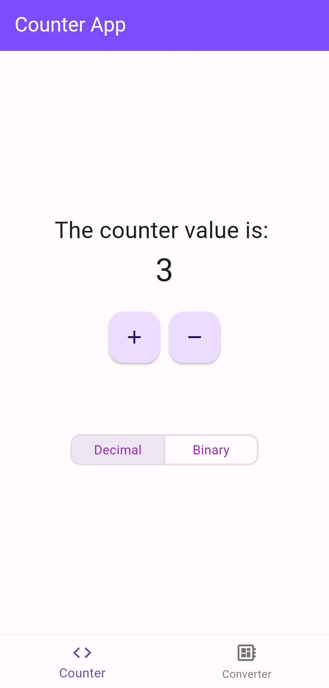

# Decimal-Binary Interconversion App

Your one stop solution to all decimal-binary interconversion problems ! 

# Features:
1) Counter - Allowing you to increment and decrement
2) Toggle Switch - Lets you view the binary value corresponding to the current counter value</>
3) Converter - Allowing you to access the decimal corresponding to any binary

# Images for Reference:

The initial page which opens up on launch

Decimal and Binary switches on changing the counter value:
1) counter value set to 3

2) counter value set to 10

The converter page

